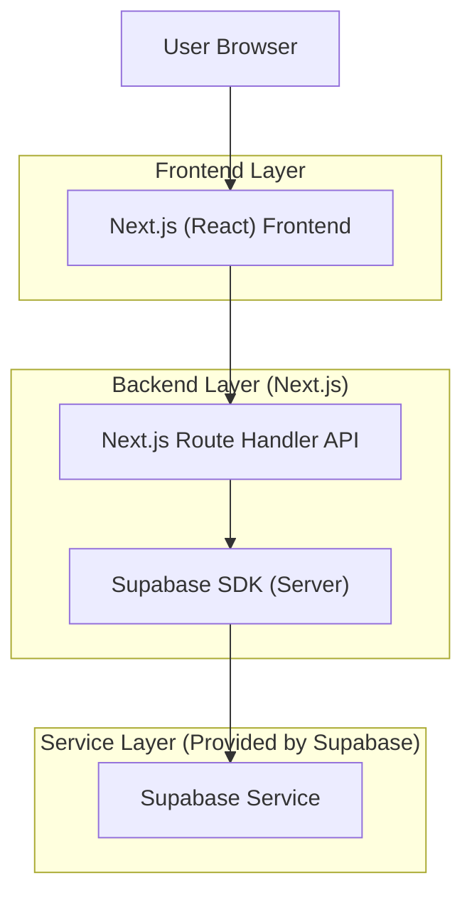
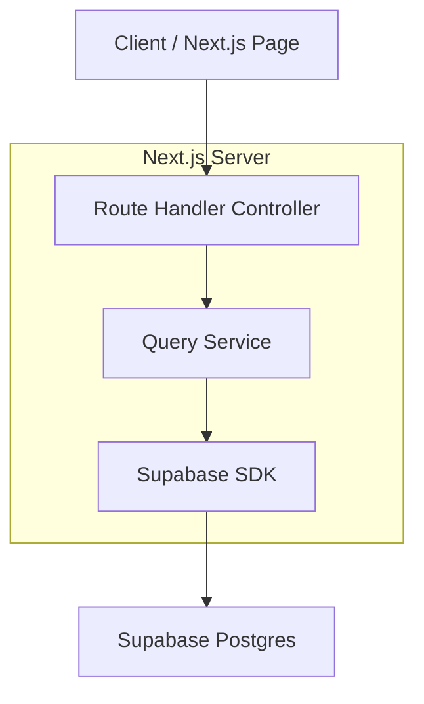
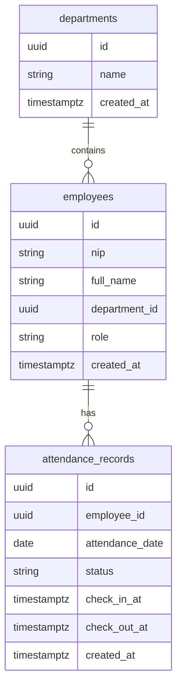

## 1.Architecture design


## 2.Technology Description
- Frontend: Next.js (React) + TypeScript + tailwindcss
- Backend: Next.js Route Handlers (server-side) + Supabase (Auth + PostgreSQL)

## 3.Route definitions
| Route | Purpose |
|-------|---------|
| /presensi | Halaman presensi: KPI, filter, tabel ringkasan, tabel data, pagination |

## 4.API definitions (If it includes backend services)
### 4.1 Core API
Ambil data presensi (paged) sesuai filter
```
GET /api/attendance
```
Query:
| Param Name| Param Type | isRequired | Description |
|----------|------------|------------|-------------|
| from | string (YYYY-MM-DD) | true | Tanggal mulai |
| to | string (YYYY-MM-DD) | true | Tanggal akhir |
| departmentId | string | false | Filter unit/departemen |
| status | string | false | Filter status (mis. hadir/terlambat/izin/alpha) |
| q | string | false | Pencarian nama/NIP |
| page | number | true | Halaman (mulai 1) |
| pageSize | number | true | Ukuran halaman |

Response (ringkas):
```ts
export type AttendanceStatus = 'hadir' | 'terlambat' | 'izin' | 'alpha'

export type AttendanceRow = {
  id: string
  attendanceDate: string
  employeeId: string
  employeeName: string
  employeeNip: string
  departmentName: string
  status: AttendanceStatus
  checkInAt: string | null
  checkOutAt: string | null
}

export type PagedResult<T> = {
  data: T[]
  page: number
  pageSize: number
  total: number
}
```

Ambil KPI + tabel ringkasan sesuai filter
```
GET /api/attendance/summary
```
Response (ringkas):
```ts
export type AttendanceKpi = {
  hadir: number
  terlambat: number
  izin: number
  alpha: number
}

export type AttendanceSummaryRow = {
  label: string // contoh: nama status atau nama departemen
  count: number
}

export type AttendanceSummaryResponse = {
  kpi: AttendanceKpi
  summaryTable: AttendanceSummaryRow[]
}
```

## 5.Server architecture diagram (If it includes backend services)


## 6.Data model(if applicable)
### 6.1 Data model definition


### 6.2 Data Definition Language
Departments (departments)
```
CREATE TABLE departments (
  id UUID PRIMARY KEY DEFAULT gen_random_uuid(),
  name VARCHAR(120) NOT NULL,
  created_at TIMESTAMP WITH TIME ZONE DEFAULT NOW()
);

GRANT SELECT ON departments TO anon;
GRANT ALL PRIVILEGES ON departments TO authenticated;
```

Employees (employees)
```
CREATE TABLE employees (
  id UUID PRIMARY KEY DEFAULT gen_random_uuid(),
  nip VARCHAR(50) UNIQUE NOT NULL,
  full_name VARCHAR(150) NOT NULL,
  department_id UUID NULL, -- logical FK
  role VARCHAR(30) DEFAULT 'employee',
  created_at TIMESTAMP WITH TIME ZONE DEFAULT NOW()
);

CREATE INDEX idx_employees_department_id ON employees(department_id);

GRANT SELECT ON employees TO anon;
GRANT ALL PRIVILEGES ON employees TO authenticated;
```

Attendance Records (attendance_records)
```
CREATE TABLE attendance_records (
  id UUID PRIMARY KEY DEFAULT gen_random_uuid(),
  employee_id UUID NOT NULL, -- logical FK
  attendance_date DATE NOT NULL,
  status VARCHAR(20) NOT NULL,
  check_in_at TIMESTAMP WITH TIME ZONE NULL,
  check_out_at TIMESTAMP WITH TIME ZONE NULL,
  created_at TIMESTAMP WITH TIME ZONE DEFAULT NOW()
);

CREATE INDEX idx_attendance_employee_date ON attendance_records(employee_id, attendance_date DESC);
CREATE INDEX idx_attendance_date ON attendance_records(attendance_date DESC);
CREATE INDEX idx_attendance_status ON attendance_records(status);

GRANT SELECT ON attendance_records TO anon;
GRANT ALL PRIVILEGES ON attendance_records TO authenticated;
```